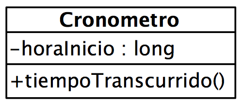

# Ejercicio 3 - Cronómetro

Crea un programa que implemente la clase Cronometro:



El programa mostrará al usuario un menú con las siguientes opciones:

- Nuevo cronómetro
- Consultar cronómetro
- Salir

Para medir el tiempo, se puede usar:

```java
// Instante inicial
long startTime = System.nanoTime();    

// Cálculo del tiempo transcurrido
long estimatedTime = System.nanoTime() - startTime;
```

El programa permitirá crear un máximo de 10 cronómetros simultáneos.